# Exercise 3 — Advanced Database Systems (Summer 2026)

**Author:** Evgenii Tomilin 
**Date:** June 2026

---

## Exercise 1: Scalar and Vector Clocks 

### (a) Scalar Clocks

scalar clock uses following algo :\
 a) sender S increase self timer, send current S time as payload \
 b) receiver R set time to max (local R time , received S time) +1 

So the goal is to correctly identify discrete states, looking to the diagram.\
Results as below. 

| Step | Event | Calculation | State After Event |
|---|---|---|---|
| 0 | Initial state | — | a:1 b:4 c:3 |
| 1 | b sends m1 → a | b = 4+1 = 5 | a:1 b:5 c:3 |
| 2 | a receives m1 | a = max(1,5)+1 = 6 | a:6 b:5 c:3 |
| 3 | b sends m2 → a | b = 5+1 = 6 | a:6 b:6 c:3 |
| 4 | a sends m3 → c | a = 6+1 = 7 | a:7 b:6 c:3 |
| 5 | c receives m3 | c = max(3,7)+1 = 8 | a:7 b:6 c:8 |
| 6 | a receives m2 | a = max(7,6)+1 = 8 | a:8 b:6 c:8 |
| 7 | Stable state (empty circles) | — | **a:8 b:6 c:8** |
| 8 | c sends m5 → b | c = 8+1 = 9 | a:8 b:6 c:9 |
| 9 | a sends m4 → b | a = 8+1 = 9 | a:9 b:6 c:9 |
| 10 | b receives m4 | b = max(6,9)+1 = 10 | a:9 b:10 c:9 |
| 11 | b receives m5 | b = max(10,9)+1 = 11 | a:9 b:11 c:9 |
| 12 | Stable state (empty circles) | — | **a:9 b:11 c:9** |

<div style="page-break-after: always;"></div>

### (b) Vector Clocks
Absolutely the same as (a) instead of scalar the vector is send.\
Logic is pretty the same : 
  - onSend : increase self timer, write to own position in vector, send
  - onReceive : for each component -> max (incoming , self) , increase self component timer 
Assume vector indexes are mapped as [a,b,c] then event stream looks like this

| seq | event | [a state],[b state],[c state] | calculus |
|---|---|---|---|
| 0 | initial | [3,1,2], [2,4,3], [5,2,1] | |
| 1 | b sends m1 to c | [3,1,2], [2,5,3], [5,2,1] | [], [,+1,], [] |
| 2 | c receives m1 | [3,1,2], [2,5,3], [5,5,4] | [], [], [max(5,2), max(2,5), max(1,3)+1] |
| 3 | a sends m2 to c | [4,1,2], [2,5,3], [5,5,4] | [+1,,], [], [] |
| 4 | c receives m2 | [4,1,2], [2,5,3], [5,5,5] | [], [], [max(5,4), max(5,1), max(4,2)+1] |
| 5 | c sends m3 to a | [4,1,2], [2,5,3], [5,5,6] | [], [], [,,+1] |
| 6 | a receives m3 | [6,5,6], [2,5,3], [5,5,6] | [max(4,5)+1, max(1,5), max(2,6)], [], [] |
| 7 | **stable state (fill in boxes)** | **[6,5,6], [2,5,3], [5,5,6]** | |
| 8 | b sends m4 to a | [6,5,6], [2,6,3], [5,5,6] | [], [,+1,], [] |
| 9 | c sends m5 to b | [6,5,6], [2,6,3], [5,5,7] | [], [], [,,+1] |
| 10 | a receives m4 | [7,6,6], [2,6,3], [5,5,7] | [max(6,2)+1, max(5,6), max(6,3)], [], [] |
| 11 | b receives m5 | [7,6,6], [5,7,7], [5,5,7] | [], [max(2,5), max(6,5)+1, max(3,7)], [] |
| 12 | **stable state (fill in boxes)** | **[7,6,6], [5,7,7], [5,5,7]** | |

<div style="page-break-after: always;"></div>

## Exercise 2: Denormalization 

### (a) Original Relational Model — ER Diagram

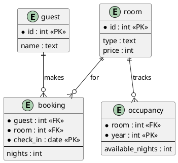

**Problem** : to get  "guests who stayed in 2025" from task, one have to traverse every guest, then every nested booking, parse *check_in*, and collect names.Without indexing or denormalization — O(N) scan over all guests and bookings.

### Requirements extraction

R - explicit, C - implicit, taken form data relations and structure.

- **R1**: "List names of guests who stayed at the hotel in a given year" must be fast
- **R2**: the *booking* relation is updated frequently — updates must be efficient
- **R3**: *room*, *occupancy*, and *guest* are rarely updated — updates to these can be expensive
  - **C1**: <u>no double-booking </u>: a room cannot have two bookings with overlapping date ranges: booking is 1-n to room - date is underlined, thus PK and must be unique
  - **C2**: <u>capacity cap</u>: sum of booked nights for room R in year Y ≤ *occupancy.available_nights* for (R, Y): *occupancy* keyed by (room, year) tracks available nights per room-year; *SUM(booking.nights)* exceeding *available_nights* means oversold, the table is used to prevent this
  - **C3**: <u>one room per booking</u>: *booking.room* is scalar FK — structurally one room per row
  - **C4**: <u>JSON schema referential integrity</u>: *booking.guest* ⊆ *guest.id*, *booking.room* ⊆ *room.id*, *occupancy.room* ⊆ *room.id*: FK columns declared in schema — dangling references break the relational model
  - **C5**: <u>cross-year bookings impossible</u>: for given schema *occupancy* PK is (room, year) has calendar-year granularity, there's no MM-DD in date; booking crossing 31 Dec would draw nights from two occupancy records
  - **C6**: <u>guest uniqueness</u>: *guest.id* is PK which implies uniqueness by definition
  - **C7**: <u>rooms number</u>: biggest hotel on Earth has 7351 rooms we can safely assume this as a room number cap 
  - **C8**: <u>usage cycle</u>: common lifecycle for software is 10 years, I'll take it as safe cap. 

### Denormalized JSON model for optimal performance

**Design rationale.** Course slides gives a clear hint : *document stores do not support joins for performance reasons* thus I have to combine all fields into one flat JSON with redundancy to avoid cross joins.

Here, R1 is the dominant and R3 states that three of the four tables rarely changed. Each booking belongs to exactly one guest and one room. Since a hotel has a physical room capacity (C7), a full year of booking data is bounded (see below), Thus full set can fit well within an in-memory for linear scan. A single flat collection scanned once is faster than any multi-collection "JSON joins" course materials explicitly rejects joins at the database level.

#### Worst case estimate
Assume UTF-8 Json without pretty print , then 
N = 7351 rooms × 365 days= 2 683 115 bookings

one booking estimate
```text
 #   field                                           bytes  sum B
--   ---------------------------------------------  -----  -----
 0   {"bk9999999":{                                     16     16
 1   "guest_id":9999999,                                19     35
 2   "guest_name":"X…X",                                64     99
 3   "room_id":7351,                                    15    114
 4   "room_type":"Double",                              22    136
 5   "room_price":9999,                                 19    155
 6   "nights":1,                                        11    166
 7   "check_in":"31-12-2025",                           26    192
 8   "year":2025,                                       12    204
 9   "occupancy":{"2016":{…},"2017":{…},…,"2025":{…}}  328    532
10   }}}                                                 3    535
--   ---------------------------------------------  -----  -----
                                                       535 B
```
Which gives 2683115×535=1435466525 B , roughly **1.34 GB** max size.
Any modern smartphone can handle this in memory.

**Chosen approach:** a single collection *booking.json* where each document is a fully denormalized booking record. All fields from the original four tables are collapsed into one flat object per booking. 

This is denormalization into the "many-side" : guest name, room type/price, and occupancy data are repeated in every booking instance.

Since room, guest, and occupancy data rarely change (R3), the redundancy is harmless: data is written once per booking and rarely invalidated.

The application can cache room/guest info when constructing new booking documents.

<div style="page-break-after: always;"></div>

#### Formal description of schema (JSON Schema)

```json
{
  "$schema": "http://json-schema.org/draft-07/schema#",
  "title": "Denormalized booking",
  "description": "Single-collection denormalized booking document that stores all items. patternProperties with regex '^bk[1-9][0-9]*$' validates dynamically-keyed booking IDs: instead of listing every key (bk1..bk2683115) explicitly, any property name matching the regex must conform to the sub-schema below. Same trick applies to occupancy years with '^[0-9]{4}$'.",
  "type": "object",
  "patternProperties": {
    "^bk[1-9][0-9]*$": {
      "type": "object",
      "properties": {
        "guest_id": { "type": "integer", "minimum": 1 },
        "guest_name": { "type": "string", "minLength": 1 },
        "room_id": { "type": "integer", "minimum": 1 },
        "room_type": { "type": "string", "enum": ["Single", "Double", "Suite"] },
        "room_price": { "type": "integer", "minimum": 1 },
        "nights": { "type": "integer", "minimum": 1 },
        "check_in": { "type": "string", "format": "date" },
        "year": { "type": "integer", "description": "Denormalized from check_in, enables single-pass year filter without date parsing" },
        "occupancy": {
          "type": "object",
          "description": "Room occupancy data for all years, repeated in every booking for the same room (acceptable per R3)",
          "patternProperties": {
            "^[0-9]{4}$": {
              "type": "object",
              "properties": {
                "available_nights": { "type": "integer", "minimum": 0 }
              },
              "required": ["available_nights"]
            }
          }
        }
      },
      "required": ["guest_id", "guest_name", "room_id", "room_type", "room_price", "nights", "check_in", "year", "occupancy"]
    }
  }
}
```
<div style="page-break-after: always;"></div>

#### Sample JSON 
booking.json, attached to submission

```json
{
  "bk1": {
    "guest_id": 3,
    "guest_name": "Bob",
    "room_id": 1,
    "room_type": "Single",
    "room_price": 89,
    "nights": 3,
    "check_in": "05-10-2025",
    "year": 2025,
    "occupancy": {
      "2024": { "available_nights": 280 },
      "2025": { "available_nights": 310 }
    }
  },
  "bk2": {
    "guest_id": 12,
    "guest_name": "Alice",
    "room_id": 2,
    "room_type": "Double",
    "room_price": 149,
    "nights": 7,
    "check_in": "12-10-2024",
    "year": 2024,
    "occupancy": {
      "2025": { "available_nights": 240 }
    }
  },
  "bk3": {
    "guest_id": 15,
    "guest_name": "Tom",
    "room_id": 3,
    "room_type": "Suite",
    "room_price": 299,
    "nights": 2,
    "check_in": "20-03-2025",
    "year": 2025,
    "occupancy": {
      "2024": { "available_nights": 180 },
      "2025": { "available_nights": 195 }
    }
  },
  "bk4": {
    "guest_id": 15,
    "guest_name": "Tom",
    "room_id": 3,
    "room_type": "Suite",
    "room_price": 299,
    "nights": 5,
    "check_in": "30-09-2024",
    "year": 2024,
    "occupancy": {
      "2024": { "available_nights": 180 },
      "2025": { "available_nights": 195 }
    }
  },
  "bk5": {
    "guest_id": 18,
    "guest_name": "Ben",
    "room_id": 1,
    "room_type": "Single",
    "room_price": 89,
    "nights": 10,
    "check_in": "01-03-2025",
    "year": 2025,
    "occupancy": {
      "2024": { "available_nights": 280 },
      "2025": { "available_nights": 310 }
    }
  }
}
```

---

## Exercise 3: Graph Databases — Neo4j

### 1.(i) List all the distinct languages that are spoken by at least one person who has also received at least one award.

```text
MATCH (p:Person)-[:SPEAKS_LANGUAGE]->(l:Language)
WHERE EXISTS { (p)-[:RECEIVED_AWARD]->(:Award) }
RETURN DISTINCT l.name AS language
ORDER BY language
```
#### 1.1 output
<table>
<tr>
<td width="50%">
American English,
Ancient Greek,
Arabic,
Armenian,
Australian English,
Azerbaijani,
Bangla,
Basque,
Brazilian Portuguese,
Bulgarian,
Canadian French,
Catalan,
Chinese,
Classical Chinese,
Croatian,
Czech,
Danish,
Dutch,
Egyptian Arabic,
English,
Esperanto,
Estonian,
Finnish,
French,
Galician,
Georgian,
German,
Greek,
Hausa,
Hebrew,
Hindi,
Hungarian,
Ido,
Irish,
Israeli (Modern) Hebrew,
Italian,
Japanese,
Korean,
Latin,
</td>
<td width="50%">

Latvian,
Lithuanian,
Middle French,
Modern Greek,
Nigerian Pidgin,
Norwegian,
Odia,
Papuan,
Persian,
Polish,
Portuguese,
Romanian,
Russian,
Sanskrit,
Serbian,
Slovak,
Slovene,
Spanish,
Standard Chinese,
Standard High German,
Swedish,
Swiss German,
Tamil,
Turkish,
Ukrainian,
Vietnamese,
Yiddish,
Yoruba,
renaissance Latin
</td>
</tr>
</table>


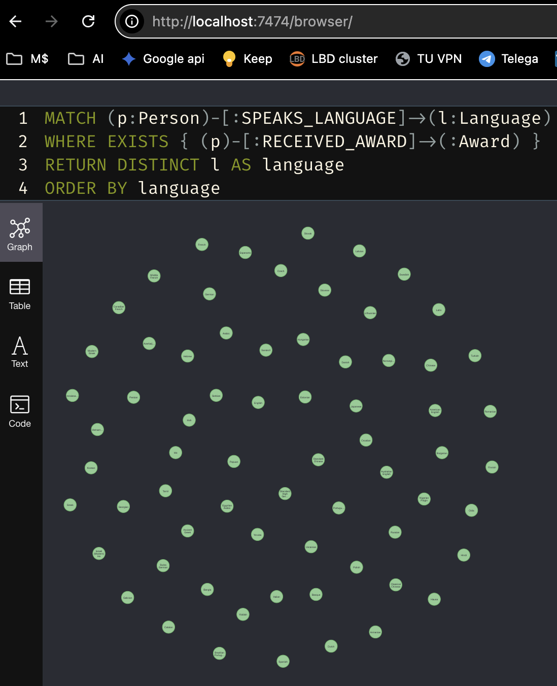

<div style="page-break-after: always;"></div>

#### 1.(ii) Distinct countries with universities where persons studied
```
MATCH (p:Person)-[:STUDIED_AT]->(u:University)-[:LOCATED_IN]->(c:Country)
RETURN DISTINCT c.name
order by c.name
```

#### 1.2 output
<table>
<tr>
<td width="50%">
Algeria;
Austria;
Austria-Hungary;
Austrian Empire;
Azerbaijan;
Belarus;
Belgium;
Bosnia and Herzegovina;
Botswana;
Brazil;
Bulgaria;
Cameroon;
Canada;
Chile;
Colombia;
Congress Poland;
Cook Islands;
Croatia;
Cyprus;
Czech Republic;
Democratic Republic of the Congo;
Denmark;
Egypt;
Estonia;
Fiji;
Finland;
France;
Georgia;
German Reich;
Germany;
Greece;
Guatemala;
Hungary;
India;
Indonesia;
Iran;
Iraq;
Ireland;
Israel;
Italy;
Japan;
Kazakhstan;
Kenya;
Kingdom of France;
Kingdom of Prussia;
Kiribati;
Kyrgyzstan;
</td>
<td width="50%">
Latvia;
Lithuania;
Malawi;
Malaysia;
Margraviate of Brandenburg;
Marshall Islands;
Mexico;
Moldova;
Morocco;
Nauru;
Nepal;
Netherlands;
New Zealand;
Nigeria;
Niue;
Norway;
Oman;
Pakistan;
People's Republic of China;
Peru;
Philippines;
Poland;
Portugal;
Prussia;
Romania;
Russia;
Russian Empire;
Saudi Arabia;
Second Polish Republic;
Serbia;
Singapore;
Solomon Islands;
South Africa;
South Korea;
Soviet Union;
Spain;
Sweden;
Switzerland;
Syria;
Taiwan;
Thailand;
Tokelau;
Tonga;
Tunisia;
Tuvalu;
Uganda;
Ukraine;
United Kingdom;
United States;
Vietnam;
Zambia
</td>
</tr>
</table>

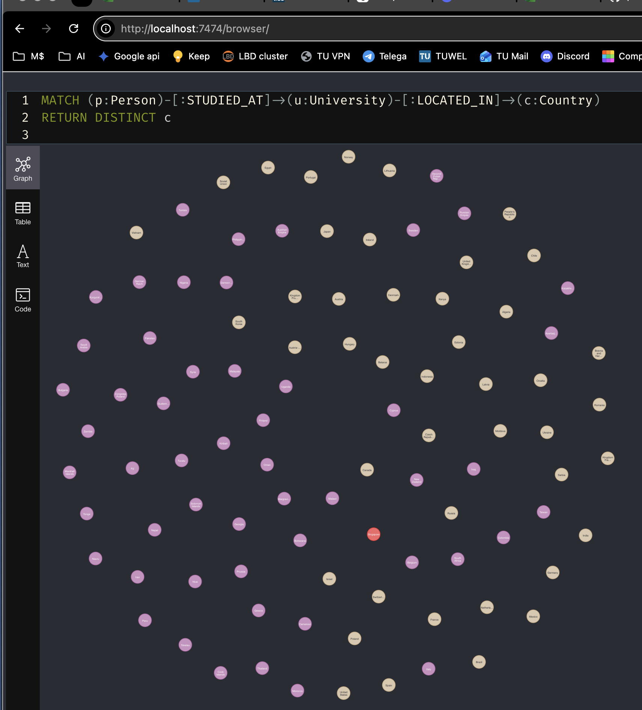

#### (iii) Countries with count of persons who studied there
```
MATCH (p:Person)-[:STUDIED_AT]->(u:University)-[:LOCATED_IN]->(c:Country)
RETURN c.name as country , COUNT(DISTINCT p) as counter
order by c.name
```

<table>
<tr>
<td width="50%">
<u>country : counter</u>

Algeria : 40;
Austria : 9723;
Austria-Hungary : 12;
Austrian Empire : 12;
Azerbaijan : 2;
Belarus : 6;
Belgium : 499;
Bosnia and Herzegovina : 2;
Botswana : 1;
Brazil : 301;
Bulgaria : 18;
Cameroon : 7;
Canada : 914;
Chile : 17;
Colombia : 18;
Congress Poland : 1;
Cook Islands : 1;
Croatia : 5;
Cyprus : 1;
Czech Republic : 421;
Democratic Republic of the Congo : 14;
Denmark : 81;
Egypt : 38;
Estonia : 114;
Fiji : 1;
Finland : 489;
France : 451;
Georgia : 1;
German Reich : 123;
Germany : 669;
Greece : 274;
Guatemala : 1;
Hungary : 236;
India : 413;
Indonesia : 8;
Iran : 192;
Iraq : 6;
Ireland : 58;
Israel : 1664;
Italy : 9593;
Japan : 707;
Kazakhstan : 178;
Kenya : 19;
Kingdom of France : 4;
Kingdom of Prussia : 123;
Kiribati : 1;
Kyrgyzstan : 8;
Latvia : 2;
Lithuania : 14;
Malawi : 1;
</td>
<td width="50%">
Malaysia : 11;
Margraviate of Brandenburg : 6;
Marshall Islands : 1;
Mexico : 307;
Moldova : 4;
Morocco : 33;
Nauru : 1;
Nepal : 8;
Netherlands : 3876;
New Zealand : 110;
Nigeria : 32;
Niue : 1;
Norway : 259;
Oman : 1;
Pakistan : 9;
People's Republic of China : 1112;
Peru : 8;
Philippines : 1;
Poland : 1775;
Portugal : 75;
Prussia : 6;
Romania : 674;
Russia : 395;
Russian Empire : 4;
Saudi Arabia : 41;
Second Polish Republic : 12;
Serbia : 1;
Singapore : 102;
Solomon Islands : 1;
South Africa : 177;
South Korea : 83;
Soviet Union : 296;
Spain : 3088;
Sweden : 11284;
Switzerland : 2032;
Syria : 1;
Taiwan : 33;
Thailand : 108;
Tokelau : 1;
Tonga : 1;
Tunisia : 105;
Tuvalu : 1;
Uganda : 1;
Ukraine : 722;
United Kingdom : 20939;
United States : 28034;
Vietnam : 10;
Zambia : 1
</td>
</tr>
</table>

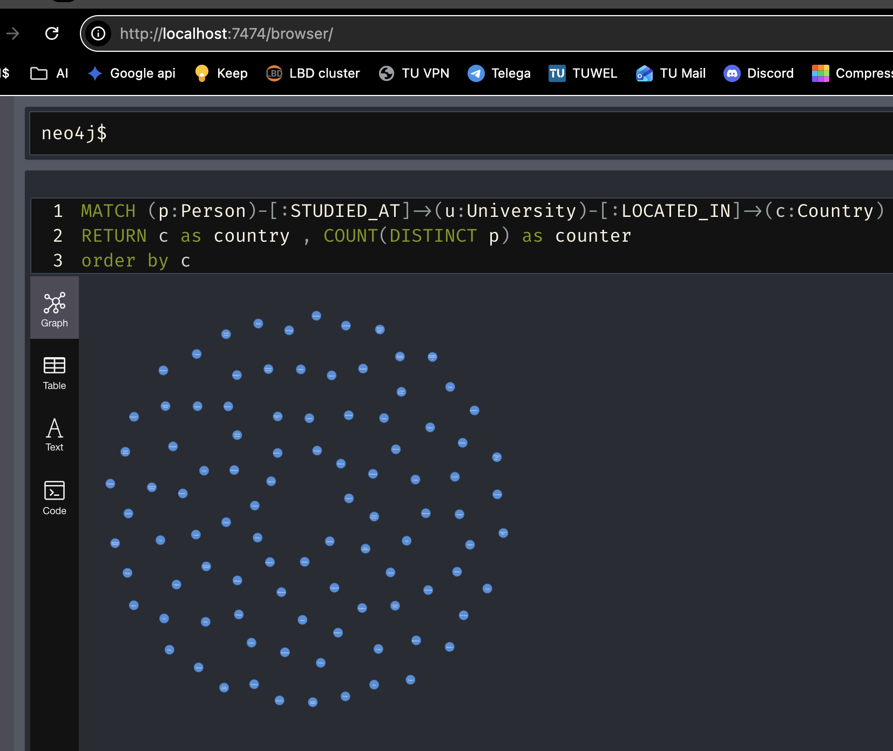

#### 1(iv) Countries with count of multilingual (≥2 languages) persons who studied there
```
MATCH (p:Person)-[:SPEAKS_LANGUAGE]->(l:Language)
MATCH (p)-[:STUDIED_AT]->(:University)-[:LOCATED_IN]->(c:Country) // p is bound person var
WITH p, c, COUNT(DISTINCT l) AS lang_count
WHERE lang_count >= 2
RETURN c.name AS country, COUNT(DISTINCT p) AS persons
ORDER BY persons DESC

``` 
<u>country : persons </u>

United States : 272;
Netherlands : 210;
Italy : 184;
Poland : 147;
Czech Republic : 112;
Austria : 107;
Israel : 94;
Sweden : 76;
Japan : 62;
United Kingdom : 59;
Romania : 56;
Hungary : 31;
Greece : 26;
Finland : 24;
Germany : 20;
People's Republic of China : 20;
Soviet Union : 20;
Belgium : 19;
Switzerland : 19;
Spain : 17;
Brazil : 10;
Russia : 10;
Estonia : 10;
German Reich : 10;
Kingdom of Prussia : 10;
Egypt : 8;
Mexico : 7;
Canada : 7;
Ukraine : 7;
Peru : 5;
France : 4;
Moldova : 3;
India : 3;
Nigeria : 3;
Norway : 3;
South Africa : 2;
Austrian Empire : 2;
Second Polish Republic : 2;
Austria-Hungary : 2;
Azerbaijan : 2;
Tunisia : 2;
Prussia : 1;
Margraviate of Brandenburg : 1;
Portugal : 1;
Congress Poland : 1;
Bulgaria : 1;
Thailand : 1;
Algeria : 1;
New Zealand : 1

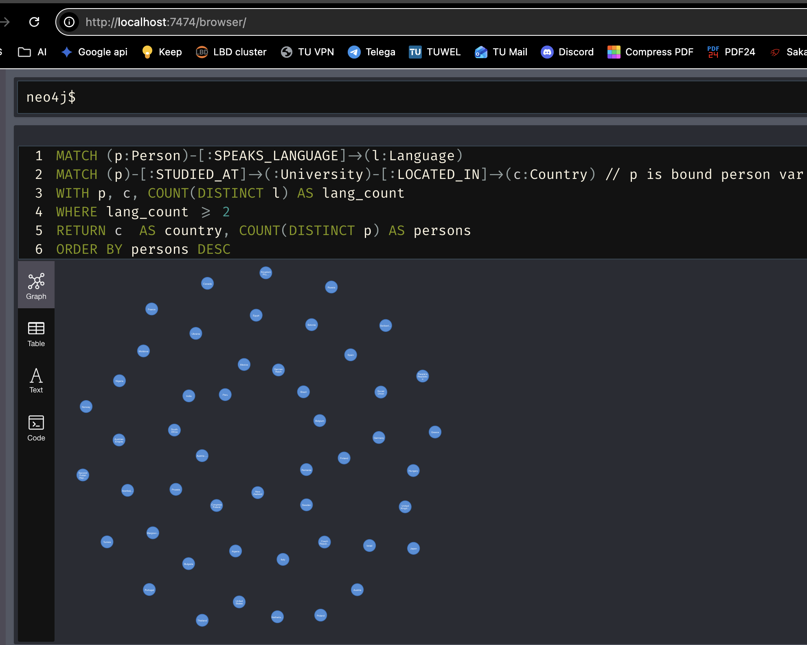

### 2. Top-K Queries

#### (i) Top 10 universities by employees

```
MATCH (p:Person)-[:EMPLOYED_AT]->(u:University)
RETURN u.name AS un, COUNT(DISTINCT p) AS prsn_cnt
ORDER BY prsn_cnt desc , u.name
limit 10
```
**un : prsn_cnt** ;

Massachusetts Institute of Technology : 297;\
Leiden University : 295;\
Princeton University : 276;\
University of California, Los Angeles : 261;\
University of California, Berkeley : 240;\
Harvard University : 233;\
University of Michigan : 216;\
Institute for Advanced Study : 208;\
Delft University of Technology : 206;\
Stanford University : 196

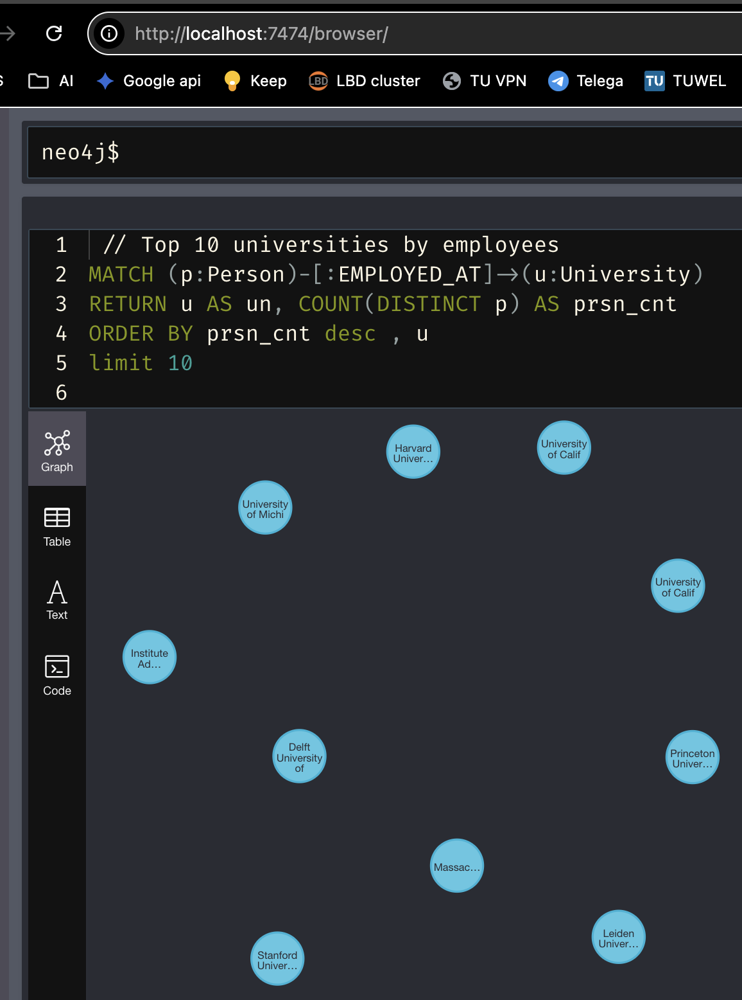

#### (ii) Top 10 regions by number of persons born there
```
MATCH (p:Person)-[:BORN_IN]->(:Place)-[:LOCATED_IN]->(r:Region)
RETURN r.name AS reg, COUNT(DISTINCT p) AS prsn_cnt
ORDER BY prsn_cnt DESC, r.name
LIMIT 10
```
reg : prsn_cnt;
New York : 519;
New York City : 275;
Saxony : 252;
Cook County : 250;
Greater London : 183;
Grand Paris : 180;
Kingdom of France : 157;
arrondissement of Paris : 157;
Île-de-France : 157;
Amsterdam : 142

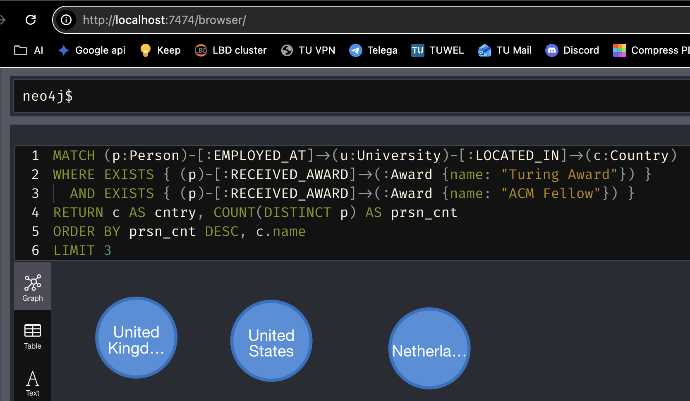

#### (iii) Top 3 countries by persons employed at local universities who won both Turing Award and ACM Fellow
```
MATCH (p:Person)-[:EMPLOYED_AT]->(u:University)-[:LOCATED_IN]->(c:Country)
WHERE EXISTS { (p)-[:RECEIVED_AWARD]->(:Award {name: "Turing Award"}) }
  AND EXISTS { (p)-[:RECEIVED_AWARD]->(:Award {name: "ACM Fellow"}) }
RETURN c AS cntry, COUNT(DISTINCT p) AS prsn_cnt
ORDER BY prsn_cnt DESC, c.name
LIMIT 3
```
cntry : prsn_cnt;
United States : 3;
Netherlands : 1;
United Kingdom : 1

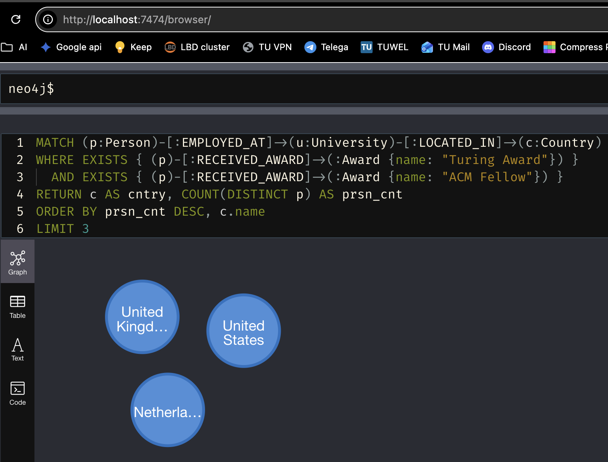

### 3. Subgraph Matching

*Find one subgraph matching the pattern: two Persons, each with RECEIVED_AWARD→Award, sharing one University (STUDIED_AT) and one Place (BORN_IN).*

```
MATCH (p1:Person)-[:STUDIED_AT]->(u:University)<-[:STUDIED_AT]-(p2:Person),
      (p1)-[:BORN_IN]->(pl:Place)<-[:BORN_IN]-(p2)
WHERE p1 <> p2
MATCH (p1)-[:RECEIVED_AWARD]->(a1:Award)
MATCH (p2)-[:RECEIVED_AWARD]->(a2:Award)
RETURN p1, a1, p2, a2, u, pl
LIMIT 1
```

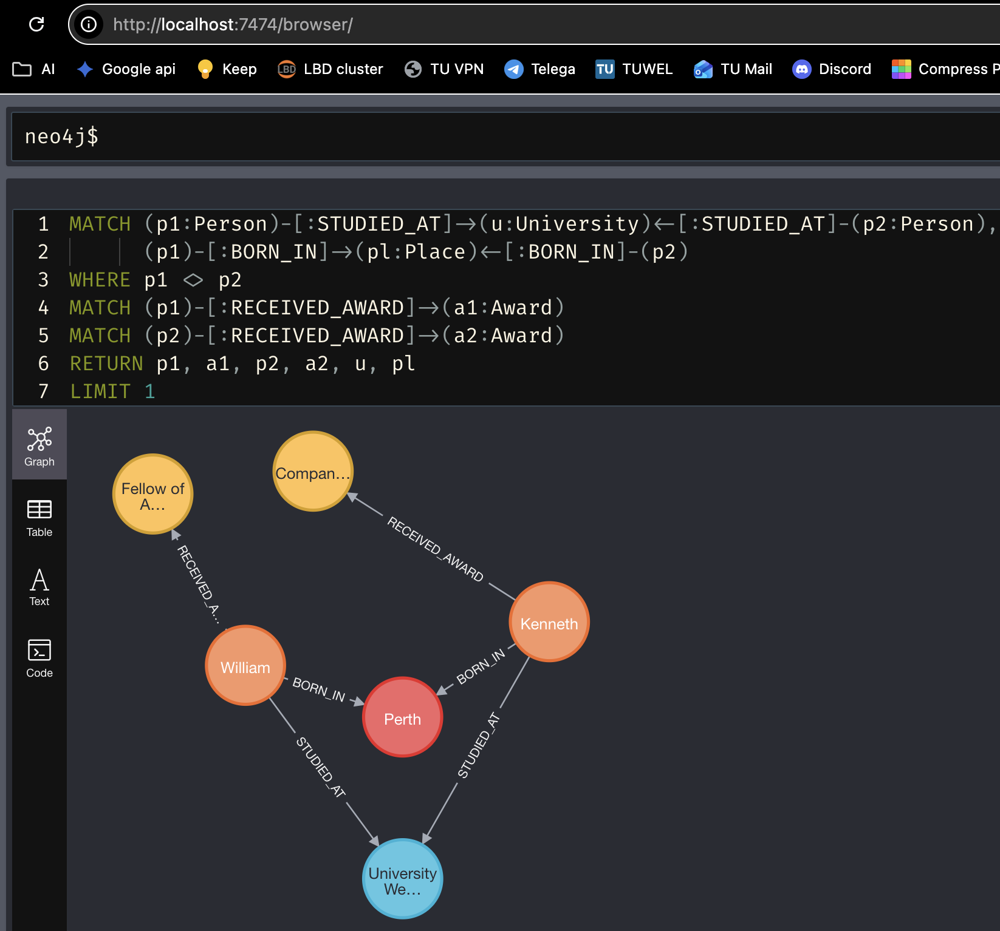

<div style="page-break-after: always;"></div>

### 4. Adding Name and DateOfBirth as Graph Nodes

#### Query to create Name and DateOfBirth nodes via MERGE

algo assumed: 
 p.Name EXISTS ? {
     (p.Name) node NOT EXISTS ? new p.Name node linked with HAS_NAME : do nothing   
 } : do nothing 

same operation for DateOfBirth using HAS_DOB link
```
MATCH (p:Person)-[:RECEIVED_AWARD]->(:Award)
WHERE p.last_name IS NOT NULL
MERGE (n:Name {name: p.last_name})
MERGE (p)-[:HAS_NAME]->(n); 
MATCH (p:Person)-[:RECEIVED_AWARD]->(:Award)
WHERE p.date_of_birth IS NOT NULL
MERGE (d:DateOfBirth {date_of_birth: p.date_of_birth})
MERGE (p)-[:HAS_DOB]->(d)
```
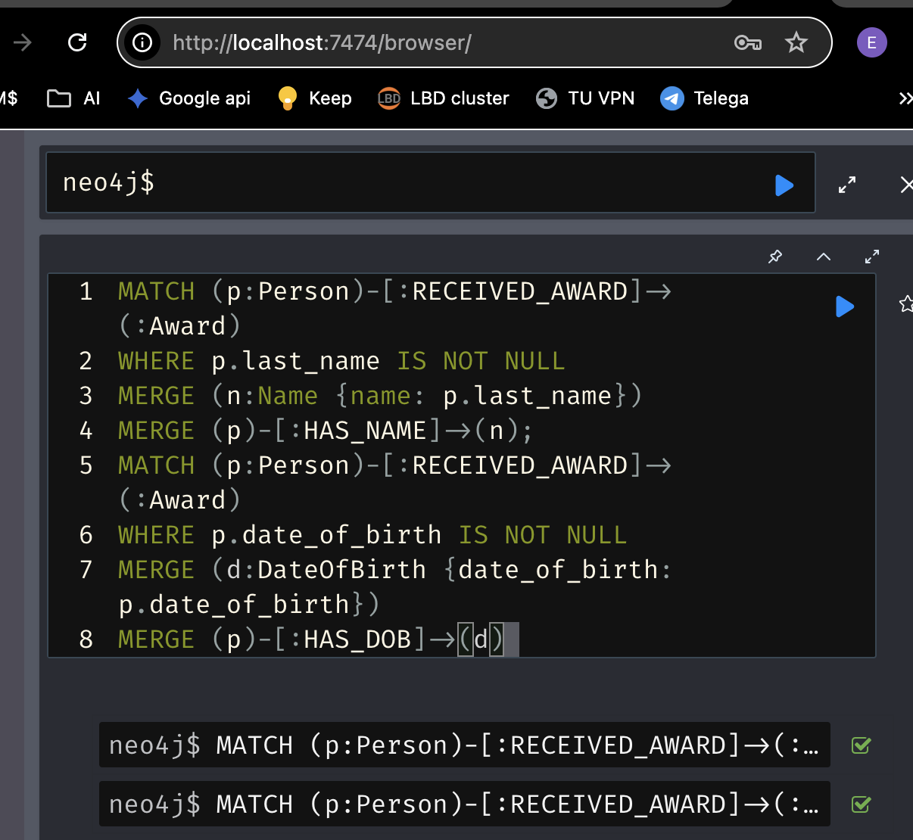
as separate block

#### query to show all the Person nodes connected to the 5 most common last names among the persons processed above.
```
MATCH (n:Name)<-[:HAS_NAME]-(p:Person)
WITH n, COUNT(p) AS cnt
ORDER BY cnt DESC
LIMIT 5
MATCH (n)<-[:HAS_NAME]-(p:Person)
RETURN n, p
```
last_name: persons;
Smith : 17;
Brown : 15;
Johnson : 15;
Cohen : 13;
Wilson :13;

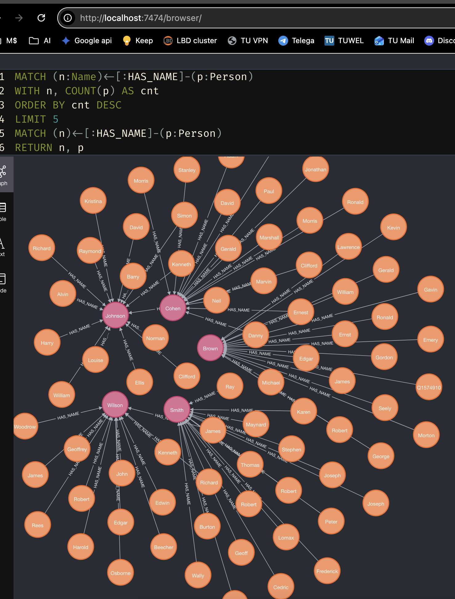

### 5. Shortest Paths on Extended Graph
The task is split in 2 steps 
 - enrich universities  with :CONNECTED_TO edges when one person studied in both and another person employed  in the same
 - shortest path search using new :CONNECTED_TO


#### enrich 
```
MATCH (u:University)<-[:STUDIED_AT]-(p1:Person)-[:STUDIED_AT]->(v:University)
WHERE u <> v  // merge creates x2 on <> , easy fix is id(u)>id(v) 
MATCH (u)<-[:EMPLOYED_AT]-(p2:Person)-[:EMPLOYED_AT]->(v)
WHERE p1 <> p2
MERGE (u)-[:CONNECTED_TO]->(v)
```
Ne edges count is 5362

note : merge links in both directions since (u,v) and (v,u) are different pairs for it. not an overhead for this task. Easy fix is to use internal node key , it is comparable int64 so > or < will give fixed order -> one direction only. 

#### count and rollback 
```
MATCH ()-[r:CONNECTED_TO]->() RETURN COUNT(r);
MATCH ()-[r:CONNECTED_TO]->() DELETE r
```
#### search path
```
MATCH (tuw:University {name: 'TU Wien'})
MATCH (german:University)-[:LOCATED_IN]->(:Country {name: 'Germany'})
MATCH p = shortestPath((tuw)-[:CONNECTED_TO*]-(german))
RETURN german.name AS university, length(p) AS distance,
       [node IN nodes(p) | node.name] AS path
ORDER BY distance, university
```

| university | distance| path |
|------------|---------|------|
|"University of Helmstedt"| 3 |["TU Wien", "University of Graz", "Martin Luther University Halle-Wittenberg", "University of Helmstedt"]|
|"University of Wittenberg"| 3 | ["TU Wien", "University of Wrocław", "Leipzig University", "University of Wittenberg"]
#### return nodes 

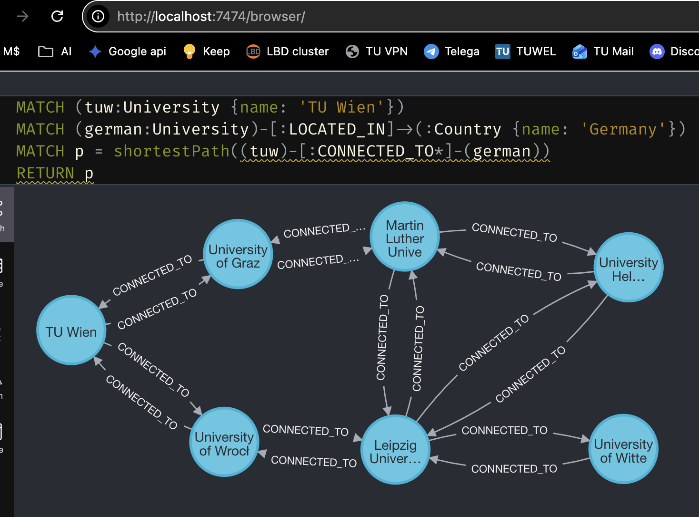

---
<div style="page-break-after: always;"></div>

## Exercise 4: Column Stores — Late Materialization
*Fill in the intermediate results for each step of the query plan.*

**Data:** (transponded from task pdf)\
id = [ 1,  2,  3   4,  5,  6]\
Ra = [ 3, 16, 25,  9,  5, 31]\
Rb = [12, 34, 17, 56, 22, 34]

id = [ 1,  2,  3]\
Sa = [34, 22, 17]\
Sb = [ 7,  4,  9]

**Plan**
1. inter1 = select(Ra, 5, 20)
2. inter2 = reconstruct(Rb, inter1)
3. join_input_S = reverse(Sa)
4. join_res = join(inter2, join_input_S) 5. inter3 = voidTail(join_res)
6. inter4 = reconstruct(Ra, inter3)
7. result = sum(inter4)

**Query:** `SELECT sum(R.a) FROM R, S WHERE R.b = S.a AND 5 <= R.a AND R.a <= 20`

### Step 1: `inter1 = select(Ra, 5, 20)`

| pos |
|-|
|2|
|4|
|5|

### Step 2: `inter2 = reconstruct(Rb, inter1)`

| pos | Rb |
|---|----|
| 2 | 34 |
| 4 | 56 |
| 5 | 22 |

### Step 3: `join_input_S = reverse(Sa)`

| Sa (key) | pos |
|---|---|
|34 | 1 |
|22 | 2 |
|17 | 3 |

### Step 4: `join_res = join(inter2, join_input_S)`

34 and 22 joined , relevant indexes below

| pos_R | pos_S|
|--|---|
| 2| 1 |
| 5| 2 | 

### Step 5: `inter3 = voidTail(join_res)`

| pos |
|---|
| 2 |
| 5 |

### Step 6: `inter4 = reconstruct(Ra, inter3)`

| pos | Ra |
|---|---|
| 2| 16|
| 5|  5|

### Step 7: `result = sum(inter4)`

| result |
|---|
| 21|
